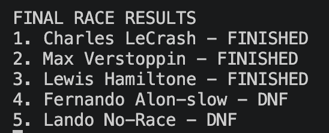
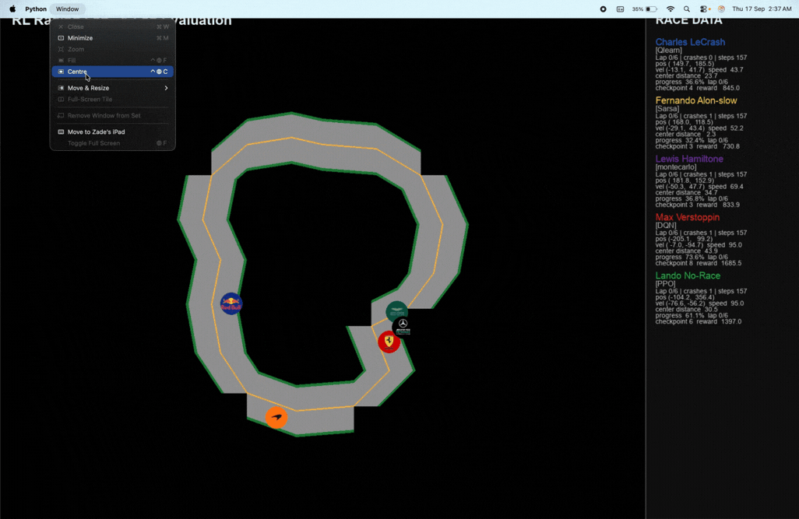
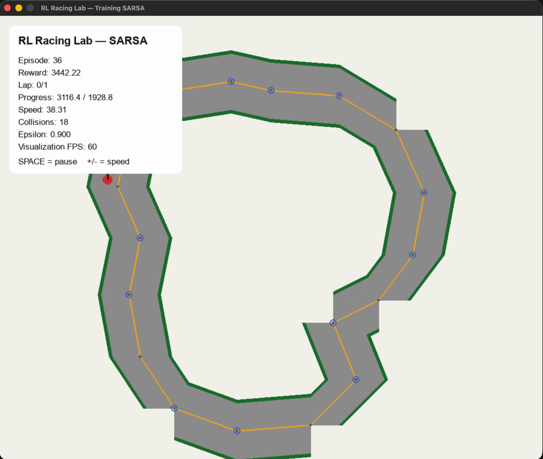
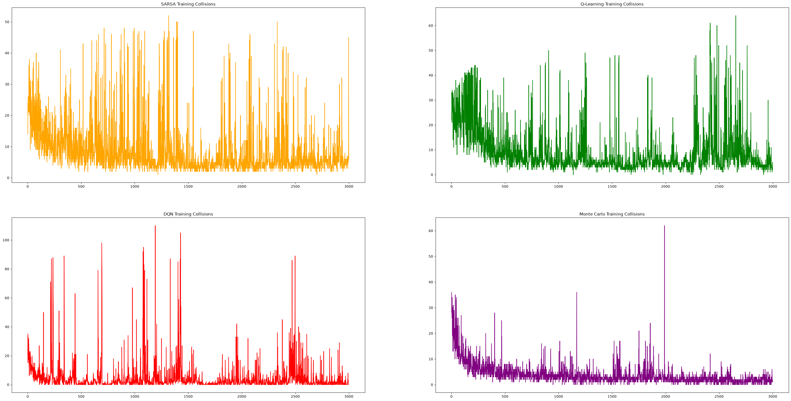
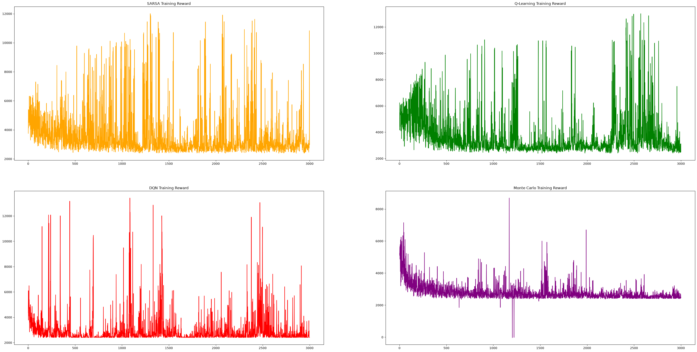
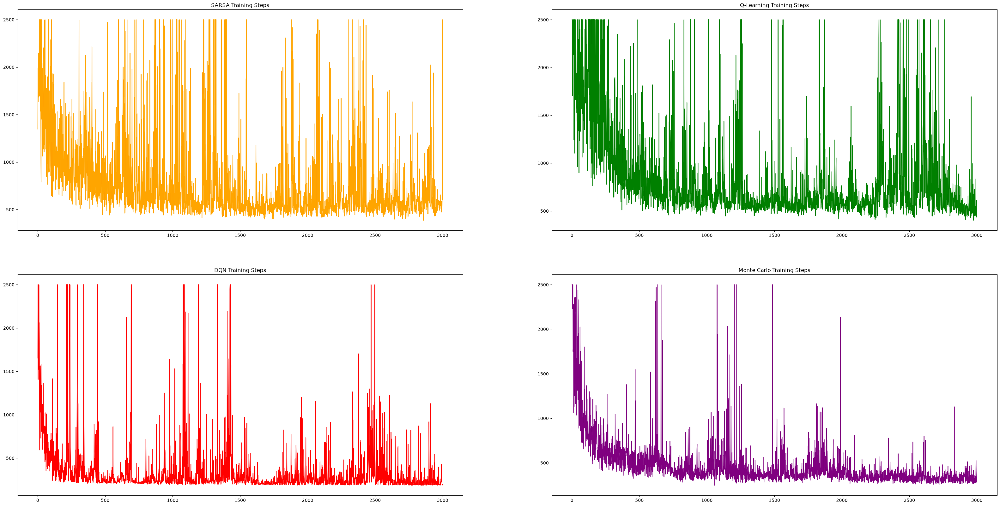

# RL Racing Lab

A small educational 2D reinforcement-learning racing environment.

## Visual overview

### Final race

The trained agents compete in a shared final race:





### Individual training session

This replay shows what a single SARSA training session looked like while the agent learned to navigate the track:



The original recording is also available as a [video file](informative_images/sarsa%20training.mov).

#### Results and agent mapping

Each driver name in the race represents a different reinforcement-learning model:

| Position | Driver | Model | Result |
| --- | --- | --- | --- |
| 1 | Charles LeCrash | Q-Learning | Finished |
| 2 | Max Verstoppin | DQN | Finished |
| 3 | Lewis Hamiltone | Monte Carlo | Finished |
| 4 | Fernando Alon-slow | SARSA | DNF |
| 5 | Lando No-Race | PPO | DNF |

**Q-Learning was the winning model**, with Charles LeCrash finishing first. DQN finished second and Monte Carlo finished third, while SARSA and PPO did not complete the race.

### Training metrics

The training runs record collisions, rewards, and episode steps for the different agents:







The same track/environment is used to train several agents:

- Random
- Q-Learning
- SARSA
- Monte Carlo
- DQN
- PPO

The agents are **trained separately** and then frozen for a final 5-lap race.

## What the environment models

- 2D `(x, y)` position
- heading and speed
- velocity `(vx, vy)` computed from position changes
- a closed-loop centerline
- a legal track corridor
- checkpoints
- wall/off-track collisions
- respawn at the latest checkpoint
- progress-based reward
- lap completion

The learning algorithms are intentionally implemented from scratch so that the RL mechanics are visible.

## Install

Python 3.10+ recommended.

```bash
pip install -r requirements.txt
```

## Run the visual environment

```bash
python main.py
```

This starts with a random agent so you can verify the environment before training.

## Train

Train one algorithm:

```bash
python train.py --algo qlearning --episodes 3000
python train.py --algo sarsa --episodes 3000
python train.py --algo montecarlo --episodes 3000
python train.py --algo dqn --episodes 1000
python train.py --algo ppo --episodes 1000
```

For the tabular methods, `--episodes 3000` is a reasonable first experiment.

DQN/PPO can take longer.

## Final race

After training at least the agents you want:

```bash
python race.py
```

The race loads the saved models that exist in `models/` and runs them together for 6 laps.

## Project structure

```text
rl_racing_lab/
├── environment.py       # track, physics, reward, collision, observation
├── agents.py            # Q-learning, SARSA, Monte Carlo, DQN, PPO
├── train.py             # training entry point
├── race.py              # frozen multi-agent race
├── main.py              # quick environment demo
├── requirements.txt
├── models/
├── logs/
└── README.md
```

## Important learning note

The environment uses continuous coordinates, but tabular Q-learning/SARSA/Monte Carlo cannot keep a table for every floating-point `(x, y)`.

Therefore:

- the **environment remains continuous**
- the tabular agents receive a **discretized feature representation**
- DQN/PPO receive the continuous normalized observation

This lets you learn both classical tabular RL and neural RL in the same world.

## Reward

The default reward is primarily based on forward progress:

- positive reward for advancing along the centerline
- small time penalty
- penalty for moving backwards
- large collision penalty
- large lap-completion reward
- episode ends after one training lap or a timeout

The reward is deliberately simple. Experiment with it — reward design is part of RL.

## Contributing

Contributions are welcome. To propose a change:

1. Fork the repository and create a focused branch for your change.
2. Install the dependencies with `pip install -r requirements.txt`.
3. Make the change and add or update tests and documentation where appropriate.
4. Run the relevant training, race, or verification commands locally.
5. Open a pull request with a clear description of the change, the motivation, and any relevant training results or screenshots.

Please keep pull requests focused, preserve the educational nature of the implementations, and avoid committing generated model files or large logs unless they are needed to reproduce the change.

## License

This project is licensed under the [Apache License 2.0](https://www.apache.org/licenses/LICENSE-2.0).
